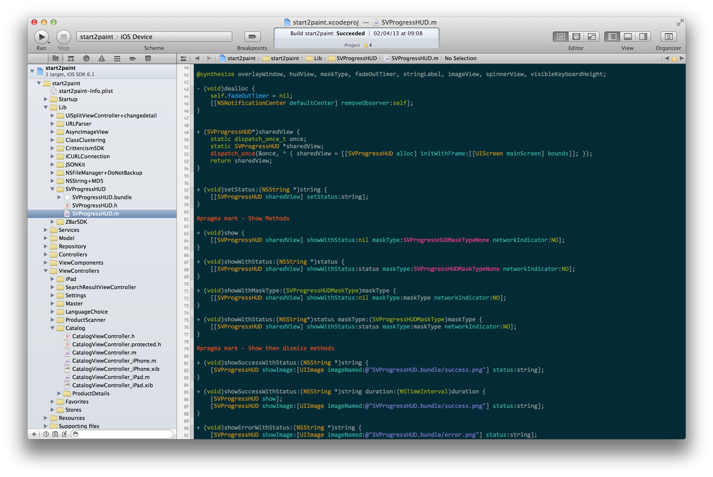
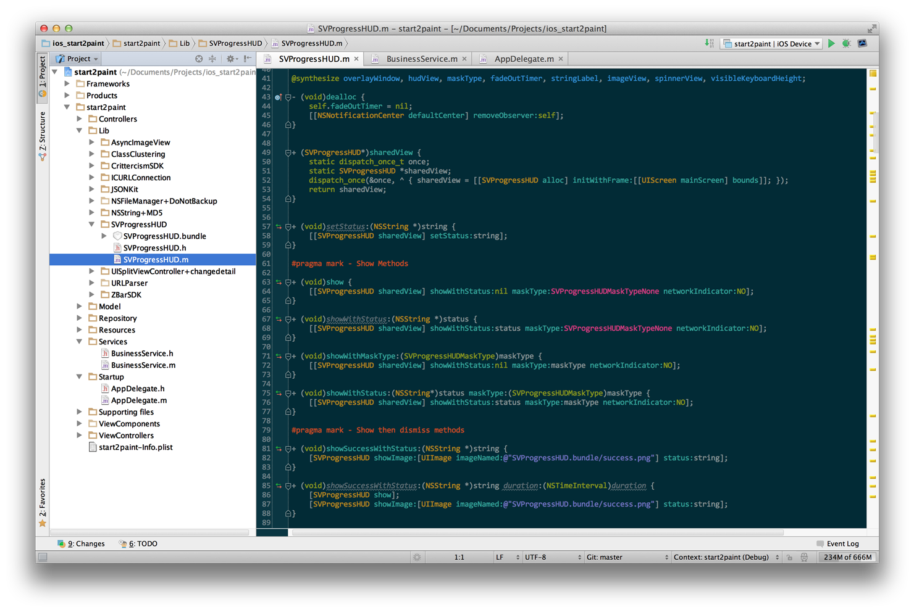

Solarized Colorschemes (Dark) - Modified
========================================

The original Solarized color scheme is developed by Ethan Schoonover (<es@ethanschoonover.com>).

This repo contains modified schemes for Xcode and AppCode 2.0, created by Wouter Martens (<woutermartens@gmail.com>).

Note: These colorscheme versions are based on personal preferences. Visit the [Solarized homepage] (or main [Solarized repository]) for the original Xcode and AppCode schemes. You'll find versions for other applications (Vim, Emacs, IntelliJ IDEA, Textmate, ...) over there as well.

[Solarized homepage]:   http://ethanschoonover.com/solarized
[Solarized repository]: https://github.com/altercation/solarized

Installation - Xcode
--------------------
1. Copy the `Solarized Dark.dvtcolortheme` file into ~/Library/Developer/Xcode/UserData/FontAndColorThemes/. You may have to create this folder if you haven't changed your color themes yet.

2. Restart Xcode.

3. Navigate to `Preferences | Fonts & Colors` and select the 'Solarized Dark' theme.

Installation - AppCode
----------------------
1. Copy `Solarized Dark.icls` into your AppCode preferences color directory: ~/Library/Preferences/appCode20/colors/.
        
2. Restart AppCode.

3. Go to `Preferences | Editor | Colors & Fonts` and select 'Solarized Dark (wuotr)' as your new theme.

Note About Fonts: Unfortunately, font settings are included in the color settings files.
You should probably modify these after adding the color schemes to your preferred IDE.
